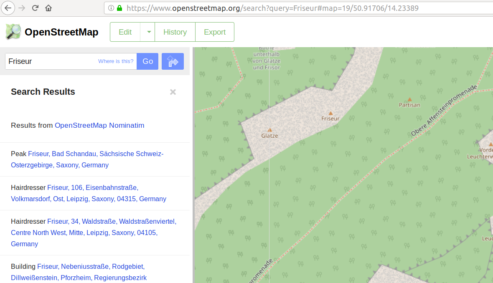
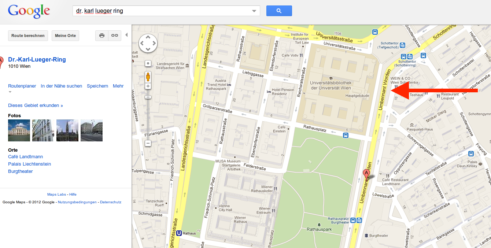
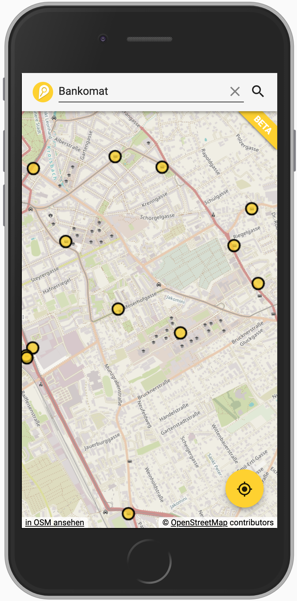
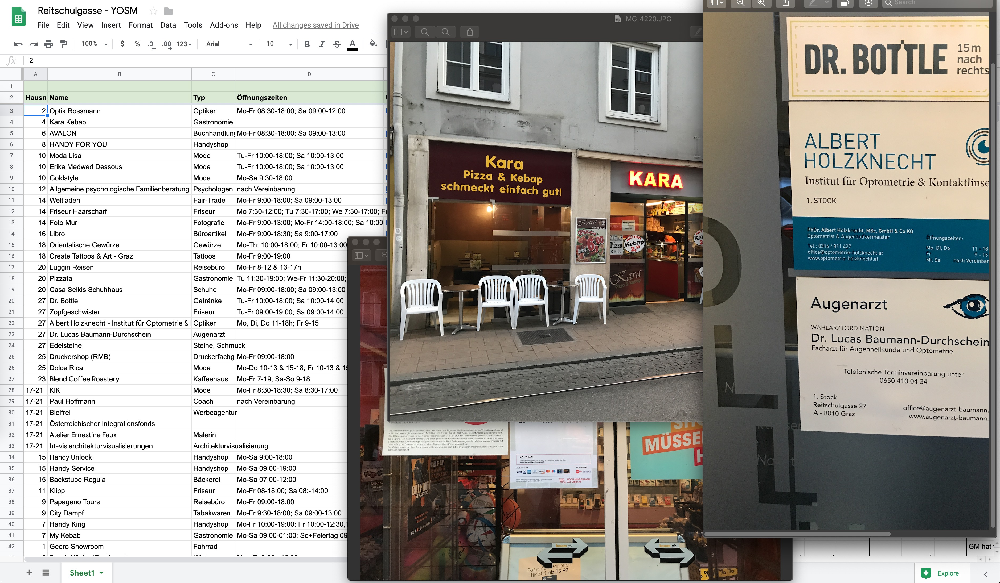
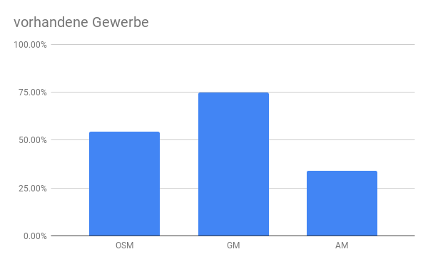
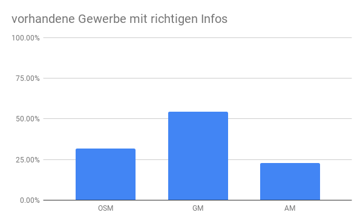
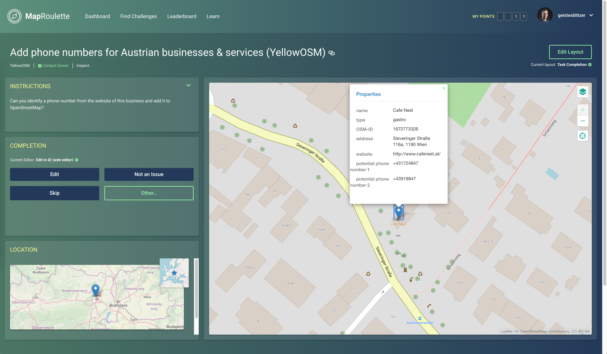
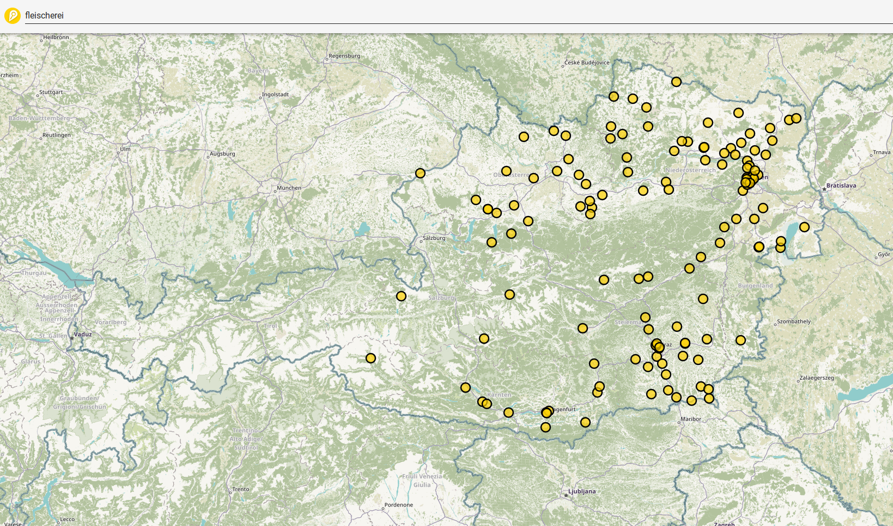
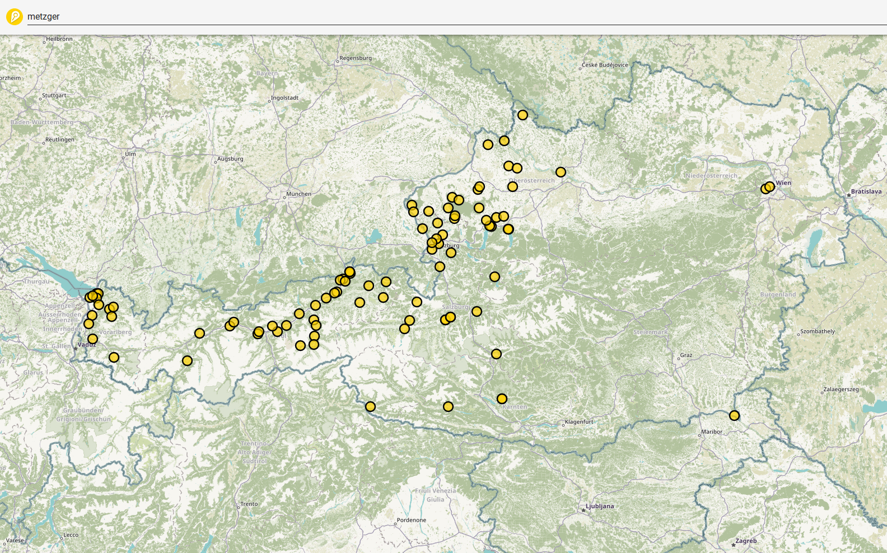
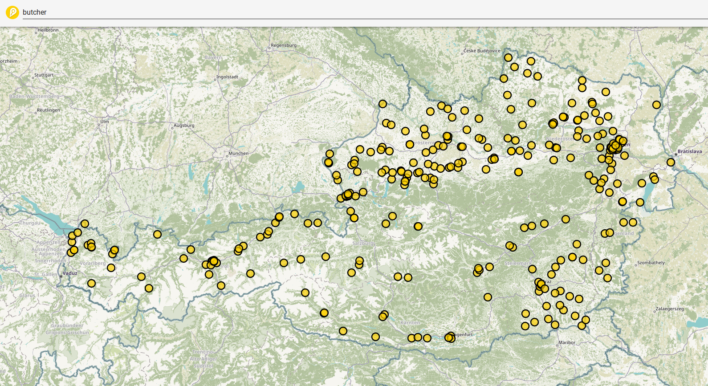

<h1 style="text-transform:none">YellowOSM</h1>
<!-- .slide: data-background-image="imgs/bg1.jpg" -->
Note: Für gute Mitarbeit gibt's sticker

# Warum?
Note: Anfangsumfrage: Wer verwendet was zu Finden eines **Friseur**? Stricherlliste etc...
verwenden: **Google, Herold, OSM**; empfehlen (**Grossmutter**):
There is google, yellowpages (aka herold), that's it. We wanted a service that
uses free data to find the right business in your neighborhood.
How do you find the next hair-dresser to your location - right now?
Afraid of **Tracking**? No? Really?
not free data, actuality, democratic?,
key features: atms, cigarette vending machine,
goal: make data more accessible, make data pool powerful and dominant like wikipedia's.

### Schon bei OSM nach "Friseur" gesucht?

# Warum?
* OpenStreetMap ist weltweit größte freie Geodatenbank
* zahlreiche Interfaces dafür, aber oft schwer zu bedienen
* auf mobilen Geräten teilweise nicht verfügbar

Note: trotz allem ist osm.org oft Hauptanlaufstelle

# Warum?
* keine freie & offene Alternative zu Google, Herold etc.
  * v.A. für Geschäfte & Dienstleistende
* undemokratisch
  * wenige Institutionen bestimmen was alle sehen
  * Werbung
  * Monopolstellung
* teilweise langsam bei Aktualisierung

Note: seit Juni 2018 ist Google Maps nur noch mit Kreditkarte auf einer Website einbindbar

## Der "umbenannt worden" Ring
<a href="https://blog.flo.cx/2012/07/der-umbenannt-worden-ring/" target="_blank">
  https://blog.flo.cx/2012/07/der-umbenannt-worden-ring/
</a>

Note: Google, TripAdvisor, Yelp, Herold

# Unsere Ziele
* Daten aus OSM allen leichter zugänglich machen
  * einfach zu bedienendes Interface
* Bearbeiten & Hinzufügen vereinfachen
  * durch den <i>Wisdom of the Crowd</i> besser werden
  * demokratischer
  * uneinholbar voran, vgl. Wikipedia, StackOverflow
* Vermeiden von Tracking

Note: OpenStreetMap as data base for business data, it's free and the best we know.

<h1 style="text-transform:none">YellowOSM</h1>
<!-- .slide: data-background-image="imgs/bg1.jpg" -->
<h2><a href="https://yellowosm.com/map">Demo Time!</a></h2>
Note: Graz herzeigen, Geschäft suchen, Details anzeigen (Öffnungszeiten...) - noch ein gutes Beispiel suchen!

## WebApp
<ul style="float:left">
  <li><a href="https://www.yellowosm.com/map">yellowosm.com</a></li>
  <li>ohne Installation nutzbar</li>
  <li>effizientere Entwicklung</li>
  <li>Fokus auf mobile Geräte</li>
  <li>immer besser unterstützt</li>
</ul>

Note: Ziel: PWA-Features verwenden (Offline-first, Notifications)

## Technik
* Daten von der <a href="https://download.geofabrik.de/europe/austria.html">Geofabrik</a>
* Import in PostgreSQL-Datenbank
* Export für Solr (Python-Skripts)
* Frontend in Angular
* Integration bestehender Tools:
  * osm2pgsql, OpenLayers, opening_hours.js

Note: Wir möchten uns gerne in die OSM-Community einbringen

## API
* offene API zur freien Verwendung
* **Gebäudeutomatisierung**: Zeige alle jetzt verfügbaren Lieferdienste in 5km Umkreis
* Einbinden in Webseiten, z.B. "Geschäfte in der Nähe"
* Auswertungen, z.B. Standortanalysen

Note: noch nicht so gut dokumentiert, bitte gerne mit uns reden

## Analyse: Datenqualität
Fallstudie: Reitschulgasse

Note: 200m lang, im Herzen von Graz

## Datenqualität: Reitschulgasse

## Datenqualität: Reitschulgasse
44 Geschäfte, Friseure, Cafés, Ärzte, Psychologen & co.

Wie viele gibt es auf der Karte?

Note: Außerdem hatte GM zwei vom Dietrichsteinplatz, AM & OSM je 5 geschlossene Geschäfte
Haben begonnen, das auszubessern
GM hat 75% davon, OSM 55%, AM 34%
komplett richtig hat GM 55%, OSM 32%, AM 23%

## Datenqualität: Reitschulgasse
Wie viele haben die richtigen Infos?

<a href="https://docs.google.com/spreadsheets/d/1R_Lc-ohfHCeDjvFcl7URPGMyoKAfwOKJbz3Uyq4M2go/edit?usp=sharing">Spreadsheet</a>

## Verbesserungen
* Crawling von Websites, Ergänzen der Daten, Machine Learning
* Bearbeiten mobil einfacher machen (OSM-ID-Editor)
* MapRoulette

## MapRoulette
<a href="https://maproulette.org/challenge/4206/">MapRoulette-Challenge</a>

## Ausblick
* Feedback einholen
* UX verbessern
* Browsing
* Datenqualität verbessern
* Projekt nachhaltig etablieren

Note: derzeit von netidee unterstützt für die Erstentwicklung
* Freemium
* Dienstleistungen für Geschäfte anbieten
* Community-finanziert (Spenden/Dienstleistungen)

* ES nice for geo-data
  * no need for Postgis in our case
* UI more complicated than you think
  * needs much thought
* Datenqualität nicht so gut für Gewerbe wie erhofft
* Daten rauschen mehr als gedacht
  * 80% Der Daten mit 20% des Aufwandes (wir treffen Annahmen - und prüfen nicht immer nach)
* contact_phone vs phone, website vs contact_website

### Fun Fact: Warum gibt's in Tirol und Vorarlberg keine Fleischer?

## Danke!

<i class="twa twa-2x twa-heart" style="margin: 50px;"></i>

* <a href="https://yellowosm.com">yellowosm.com</a>
* <a href="https://github.com/YellowOSM/YellowOSM">https://github.com/YellowOSM/YellowOSM</a>
* <a href="https://twitter.com/yellowosm">@yellowosm</a>
* <a href="https://maproulette.org/challenge/4206/">MapRoulette-Challenge</a>
* mit freundlicher Unterstützung durch <a href="https://netidee.at/yellowosm">netidee</a>
